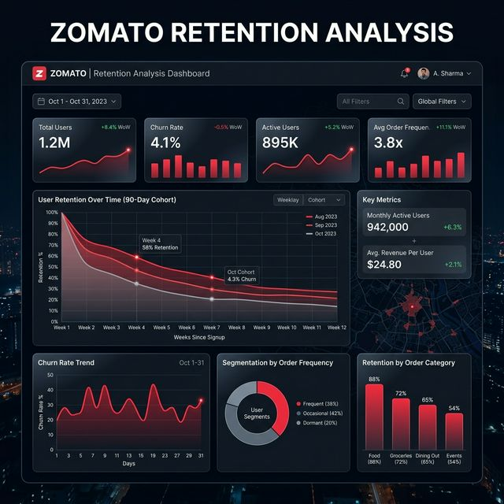

# Zomato Retention Analysis 📊🤖🍕

> **Live Website:** [zomato-retention-analysis-project.vercel.app](https://zomato-retention-analysis-project.vercel.app/)

---

## 🎯 Project Overview
An end-to-end **Data Engineering and Business Intelligence** pipeline designed to analyze and predict customer retention. This project transforms raw Zomato customer data into actionable insights through a rigorous **Star Schema** data model, served via a high-performance **FastAPI** backend and a premium **React** analytics hub.

**Perfectly suited for showcasing Business Intelligence, Data Engineering, and Data Analysis skills.**

---

## 🏗️ Architecture & Pipeline
1. **Data Ingestion & ETL**: Python scripts automate extraction, cleaning, and transformation of transactional data.
2. **Kimball Data Modeling**: Structured into a specialized Star Schema (`Dim_Users`, `Fact_Activity`) for high-performance querying.
3. **Analytics API**: A FastAPI gateway serves data aggregations and computed metrics to the frontend.
4. **Interactive Dashboard**: A custom-built React application providing real-time visualizations and retention insights.

---

## 📊 Key Features
- **Exploratory Analytics**: Interactive Pie and Bar charts for churn distribution and order-volume correlation.
- **Automated Monitoring**: Live synchronization with the backend data mart for absolute metric accuracy.
- **Premium UI**: Built with a sleek Glassmorphic design, optimized for interview presentations.
- **Explainable BI**: Focuses on clear business heuristics (Recency, Rating, Frequency) over black-box models.

---

## 💻 Tech Stack
- **Languages**: Python (Backend), JavaScript (Frontend)
- **Frameworks**: FastAPI, React + Vite
- **Data Visualization**: Recharts, Lucide-React
- **Data Processing**: Pandas, NumPy
- **Deployment**: Vercel (Frontend & Full-stack), Render (Dockerized Backend)

---

## 🚀 Deployment Guide

### Option 1: Full-stack on Vercel (Auto-Sync)
The easiest way to host the entire pipeline:
1. Connect this repo to **Vercel**.
2. Vercel will automatically use the `vercel.json` to deploy both the Frontend and the Python Backend.
3. Your dashboard will be live at the root, and the API at `/api`.

### Option 2: Split Deployment
- **Backend (Render)**: Deploy as a **Web Service** using the root `Dockerfile`.
- **Frontend (Vercel)**: Deploy the `frontend/` folder and set `VITE_API_URL` to your Render URL.

---
*Created for showcasing Data Analysis and Business Intelligence expertise.*
